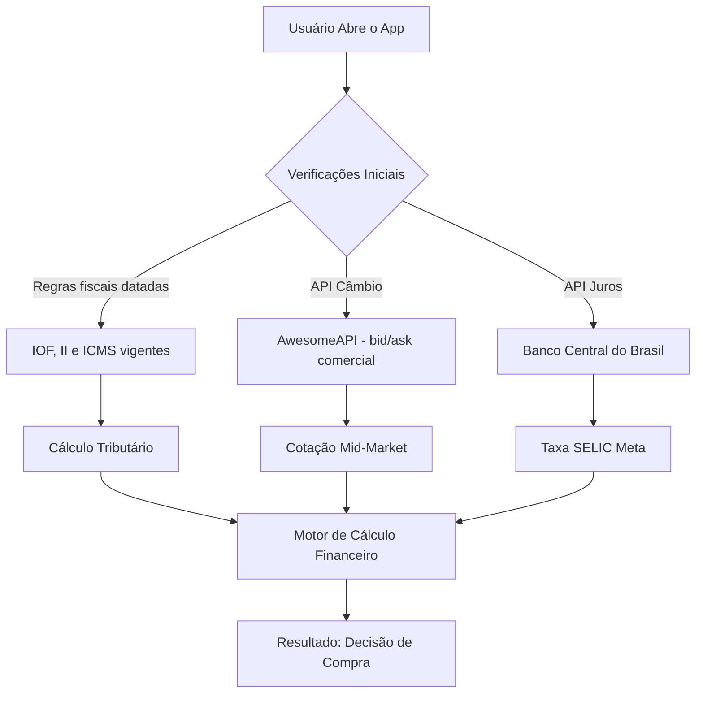

# 📄 Whitepaper: Empóros — Calculadora de Paridade de Importação

**Versão:** 2.0  
**Data:** 20/07/2026 (original: 30/11/2025)  
**Stack:** React Native (Expo) + TypeScript

---

## 1. Visão Executiva e Valor Estratégico

### O Problema
O consumidor brasileiro enfrenta um dilema constante ao adquirir bens de alto valor (eletrônicos, gadgets, luxo): *"Compro agora parcelado no Brasil ou importo à vista?"*.
A decisão raramente é óbvia. Envolve variáveis complexas: taxa de câmbio volátil, impostos flutuantes (IOF), taxas de serviço (spread) e, crucialmente, o **custo de oportunidade** do dinheiro no tempo (Taxa Selic).

### A Solução
O app (que o usuário vê como **"Vale importar?"**) não é apenas um comparador de preços. É uma calculadora financeira de **Valor Presente Líquido (VPL)** que automatiza a tomada de decisão. Ele nivela as duas opções de compra para a data presente (t=0), permitindo uma comparação matematicamente justa.

### Modelo de Negócio
1.  **Gratuito e completo:** todos os recursos e moedas para todos, sem anúncios, sem links de afiliados e sem compras dentro do app.
2.  **Código aberto (MIT), mantido por doações:** os custos de publicação nas lojas são cobertos por apoio voluntário via GitHub Sponsors e PIX, divulgados apenas fora do app — nunca dentro dele.

---

## 2. Arquitetura de Dados (Data Flow)

O aplicativo opera numa arquitetura *Serverless-Client*, consumindo dados diretamente de fontes oficiais e governamentais em tempo real, garantindo isenção e precisão.

### Fontes de Dados

  * **Câmbio (FX):** *AwesomeAPI* (economia.awesomeapi.com.br) — cotação comercial em tempo quase real, calculada como média entre bid e ask. Suporta USD, EUR, GBP, JPY, ARS e CLP numa única chamada. A última carga bem-sucedida é cacheada localmente com timestamp: offline, o app usa o cache exibindo a idade do dado, nunca valores inventados.
  * **Taxa Livre de Risco ($R_f$):** *API do Banco Central do Brasil (Série 432)*. Coleta a Meta Selic oficial.
  * **Legislação:** IOF do Decreto nº 6.306/2007 (redação do Decreto nº 12.499/2025), regime **Remessa Conforme** (Portaria MF nº 1.342/2026 — ver seção 3.4), ICMS estadual e cota de bagagem da Receita Federal. Valores, fontes e data de revisão ficam em `constants/regras-fiscais.ts` (seção 4).

-----

## 3\. Modelagem Matemática (O "Core" Financeiro)

A grande inovação do app é tratar a compra parcelada no Brasil como um fluxo de caixa negativo que deve ser descontado a valor presente.

### 3.1. Conversão de Taxas (Equivalência)

A SELIC é divulgada como taxa anual ($i_{aa}$). Para cálculos de parcelamento mensal, realizamos a conversão por juros compostos, não divisão simples.

$$
i_{am} = (1 + i_{aa})^{\frac{1}{12}} - 1
$$

*Onde:*

  * $i_{am}$ = Taxa Selic Mensal Efetiva.
  * $i_{aa}$ = Taxa Selic Anual (via API).

### 3.2. Custo Efetivo da Importação (Spot Price)

O custo de importar é calculado à vista, considerando o "Custo Efetivo Total" (CET) da operação cambial.

$$
Custo_{Ext} = P_{ext} \times [FX \times (1 + S)] \times (1 + IOF)
$$

*Onde:*

  * $P_{ext}$: Preço na etiqueta exterior (em USD ou EUR).
  * $FX$: Taxa de Câmbio Comercial.
  * $S$: *Spread* bancário (Taxa de serviço configurável pelo usuário).
  * $IOF$: Imposto sobre Operações Financeiras sobre a operação de câmbio (3,5% no cartão e em espécie).

### 3.3. Valor Presente da Compra Nacional (VP)

Para a opção Brasil, utilizamos a fórmula do **Valor Presente de uma Anuidade Postecipada** (Série Uniforme de Pagamentos). Isso responde à pergunta: *"Quanto eu precisaria ter hoje investido na Selic para pagar essas parcelas futuras?"*

$$
VP_{BR} = \frac{P_{BR}}{n} \times \left[ \frac{1 - (1 + i_{am})^{-n}}{i_{am}} \right]
$$

*Onde:*

  * $P_{BR}$: Preço total no Brasil.
  * $n$: Número de parcelas.
  * $i_{am}$: Taxa de desconto (Selic Mensal).

### 3.4. Tributação de Encomendas (Remessa Conforme)

A partir da v2.0, o app distingue dois cenários de compra no exterior:

* **Viagem:** compra presencial trazida na bagagem — aplica apenas câmbio, spread e IOF (fórmula da seção 3.2). Compras acima da cota de isenção (US$ 1.000 em voos) pagam 50% sobre o excedente, o que é sinalizado ao usuário mas não incluído no cálculo.
* **Encomenda:** compra em site internacional com entrega no Brasil — além do câmbio+spread+IOF sobre o pagamento (produto + frete), incidem os tributos do regime Remessa Conforme sobre o **valor aduaneiro** ($VA$ = produto + frete, convertido pela cotação comercial):

$$
II = \begin{cases} 0 & \text{se } VA \leq \text{US\$ } 50 \\ \max(0;\; 0{,}60 \times VA - \text{US\$ } 30 \times FX_{USD}) & \text{se } VA > \text{US\$ } 50 \end{cases}
$$

$$
ICMS = \frac{VA + II}{1 - a} \times a \quad \text{(}a = 17\% \text{ ou } 20\%\text{, conforme o estado; "por dentro")}
$$

Em sites fora do Remessa Conforme, $II = 0{,}60 \times VA$ em qualquer faixa, sem desconto. Acima de US$ 3.000 a encomenda sai do regime simplificado, e o app avisa que o cálculo não se aplica.

O limite de US$ 50 é aferido em dólar: para compras em outras moedas, o app converte via cotação cruzada ($VA_{USD} = VA_{BRL} / FX_{USD}$). O resultado exibe o *breakdown* de cada componente (pagamento, IOF, II, ICMS), e a soma dos componentes é validada por teste automatizado contra o custo total.

-----

## 4\. Regras Fiscais Datadas

Alíquotas e limites mudam por decreto, portaria ou decisão judicial, sem aviso e sem cronograma confiável. O cronograma de redução do IOF do Decreto nº 11.153/2022, que o app seguia, foi abandonado em 2025: o Decreto nº 12.499/2025 fixou o IOF em 3,5%, e a Portaria MF nº 1.342/2026 zerou o II até US$ 50 na Remessa Conforme. Por isso o app não tenta prever a lei. Ele registra o que vale hoje, com data e fonte:

| Regra | Valor | Fonte |
| :--- | :--- | :--- |
| IOF — cartão (crédito, débito, pré-pago) | **3,5%** | Decreto nº 6.306/2007, redação do Decreto nº 12.499/2025 |
| IOF — moeda em espécie | **3,5%** | idem |
| II — Remessa Conforme, até US$ 50 | **0%** | Portaria MF nº 1.342/2026 |
| II — Remessa Conforme, acima de US$ 50 (até US$ 3.000) | **60% − US$ 30** | idem |
| II — site fora do Remessa Conforme | **60%** | Receita Federal |
| ICMS sobre importação | **17% ou 20%**, conforme o estado | Comsefaz |
| Cota de bagagem (via aérea/marítima) | **US$ 1.000**; 50% sobre o excedente | Receita Federal — Guia do Viajante |

Os valores vivem em `constants/regras-fiscais.ts`, junto com `revisadoEm` (data da última conferência) e os links das fontes. O resultado de cada simulação mostra "Regras fiscais de <mês/ano>" e, ao tocar, a lista de fontes. Ao mudar uma regra: conferir a fonte, atualizar o valor, `revisadoEm` e o CHANGELOG.

-----

## 5\. Exemplo Prático de Simulação

Imagine a compra de um Smartphone em **outubro de 2026**.

**Dados de Entrada:**

  * **Brasil:** R$ 5.000,00 em 12x "sem juros".
  * **EUA:** US$ 800,00.
  * **Selic:** 11.25% a.a. ($\approx$ 0.89% a.m.).
  * **Câmbio:** R$ 5,00.
  * **Pagamento:** Cartão (IOF de 3,5%).
  * **Spread:** 2.0%.

**Processamento:**

1.  **Câmbio Efetivo:** $5,00 \times (1 + 0,02) = R\$ 5,10$.
2.  **Custo Importação:** $800 \times 5,10 \times (1 + 0,035) = \mathbf{R\$ 4.222,80}$.
3.  **Parcela BR:** $R\$ 416,66$.
4.  **Valor Presente BR:** Trazendo 12 parcelas de R$ 416,66 a valor presente com taxa de 0.89%.
    $$VP_{BR} = 416,66 \times \left[ \frac{1 - (1,0089)^{-12}}{0,0089} \right] \approx \mathbf{R\$ 4.720,00}$$

**Conclusão do Algoritmo:**

  * Diferencial: $R\$ 4.720,00 - R\$ 4.222,80 = R\$ 497,20$.
  * **Resultado:** "✈️ COMPRE NO EXTERIOR" (economia real de R$ 497,20).

-----

© 2025–2026 - Documentação Técnica
© 2025–2026 - Desenvolvido por Luccas de Amorim